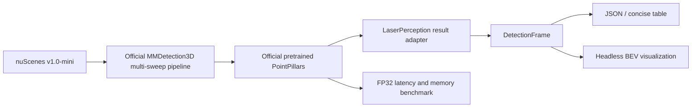

# LaserPerception

> Reproducible real-time 3D LiDAR object detection and deployment engineering.

[](https://github.com/muhammadmahadazher/laserperception/actions/workflows/ci.yml)
[](LICENSE)
[](pyproject.toml)
[](#project-status)

LaserPerception is an open-source 3D LiDAR perception toolkit focused on reproducible real-time
object detection and deployment. The active goal is a narrow, evidence-gated path from an official
pretrained PointPillars model on nuScenes to measured RTX 4060 inference, then TensorRT FP16 and
ROS 2 in later milestones.

Detection is not yet claimed as working in this repository. M1 is in progress; all unmeasured
detector results remain `Pending measurement`.

## Project status

### Active: M1 — PointPillars first sight

M1 will:

- reproduce one official pretrained MMDetection3D PointPillars model on nuScenes v1.0-mini;
- export a small, framework-independent 3D detection result contract;
- render original headless bird's-eye-view prediction visualizations; and
- measure real FP32 latency and peak GPU memory on an NVIDIA GeForce RTX 4060 Laptop GPU.

M1 is inference-only. It does not include training, a second detector, ONNX, TensorRT, mixed
precision, INT8, ROS 2, camera fusion, custom CUDA, or Jetson work.

### Existing experimental infrastructure

The earlier SemanticKITTI-to-DALES semantic-segmentation work remains in the repository as tested,
supported infrastructure, but it is parked rather than the active development line before
detection v0.1. It currently provides:

- a validated float32 `PointCloud` representation;
- KITTI/SemanticKITTI and LAS/optional LAZ I/O;
- official-split SemanticKITTI and chunked DALES directory adapters;
- explicit, non-mutating `min_xyz` normalization;
- verified mappings into a six-class experimental ontology;
- deterministic DALES grid patching and CPU-only dataset audit tooling; and
- synthetic tests that download no datasets.

No semantic-segmentation model, training run, or accuracy benchmark has been implemented. The
historical Experiment 001 config remains at
[`configs/experiments/exp001_semkitti_to_dales.yaml`](configs/experiments/exp001_semkitti_to_dales.yaml).

## Architecture

The lightweight core and standard CI remain CPU-only. M1 GPU dependencies live in an isolated WSL
environment and are imported only by the optional detector backend.



nuScenes is not routed through the existing single-scan `PointCloud`: PointPillars inference keeps
the official calibrated, multi-sweep upstream pipeline. See
[`docs/ARCHITECTURE.md`](docs/ARCHITECTURE.md).

## Core installation

LaserPerception supports Python 3.10–3.13 in CPU CI. The base package has no CUDA, PyTorch, or
MMDetection3D dependency.

```bash
git clone https://github.com/muhammadmahadazher/laserperception.git
cd laserperception
python -m venv .venv
python -m pip install --upgrade pip
python -m pip install -e .
```

Install `laserperception[laz]` for compressed LAZ support or `laserperception[dev,laz]` for local
development. No dataset or model is downloaded by core installation. The reproducible M1 GPU setup
will be documented separately and will not make heavy libraries core requirements.

## Existing CPU quickstart

```python
import numpy as np
from laserperception import PointCloud

cloud = PointCloud(
    xyz=np.array([[10.0, 20.0, 2.0], [11.5, 19.0, 3.0]]),
    labels=np.array([0, 1]),
    attributes={"intensity": np.array([120, 240])},
    metadata={"source": "synthetic"},
)
print(len(cloud), cloud.xyz.dtype)  # 2 float32
```

Load existing point-cloud formats and normalize explicitly:

```python
from laserperception.io import load_kitti_bin, load_las
from laserperception.transforms import normalize_coordinates

kitti = load_kitti_bin("sequences/00/velodyne/000000.bin")
las = load_las("tile.las")
normalized = normalize_coordinates(kitti, mode="min_xyz")
```

Dataset paths come from configuration or environment variables; datasets, checkpoints, and
generated artifacts must remain outside Git.

## Benchmarks

No detection benchmark has been run.

| Milestone | Model | Dataset | Hardware | Precision | Latency | FPS | Peak VRAM |
|---|---|---|---|---|---|---|---|
| M1 | Official PointPillars asset to be pinned | nuScenes v1.0-mini | RTX 4060 Laptop GPU | FP32 | Pending measurement | Pending measurement | Pending measurement |

The parked SemanticKITTI-to-DALES mIoU, per-class IoU, VRAM, and wall-clock fields also remain
`Pending measurement`. See [`docs/BENCHMARKS.md`](docs/BENCHMARKS.md) for acceptance criteria.

## Roadmap

- **M0:** project direction and governance transition.
- **M1:** pretrained PointPillars, nuScenes v1.0-mini, BEV predictions, RTX 4060 FP32 measurements.
- **M2:** ONNX and TensorRT FP16, only after M1 review.
- **M3:** ROS 2, only after M2 review.
- **M4:** evidence-backed v0.1 release.
- **M5:** Jetson measurements only if physical hardware is available.

See [`docs/ROADMAP.md`](docs/ROADMAP.md). Capabilities are not promised before their evidence gate.

## Repository map

```text
configs/experiments/   Parked semantic-transfer research configurations
docs/                  Architecture, environment, benchmarks, roadmap, and research documentation
src/laserperception/   Lightweight core, I/O, datasets, audits, and optional detection surface
tests/                 Synthetic CPU tests
.github/               CPU CI, security analysis, and contribution templates
```

## Safety and scientific integrity

LaserPerception is for research, benchmarking, and demonstrations. It is not safety-certified,
production-qualified, or a certified perception system for operation around people. Predictions
can be missed, misclassified, or poorly localized.

No accuracy, latency, throughput, memory, hardware, or dataset statistic is published unless it was
actually measured with documented provenance. Unknown fields use `Pending measurement`.

## Contributing, citation, and licensing

Read [`CONTRIBUTING.md`](CONTRIBUTING.md) and [`AGENTS.md`](AGENTS.md). Do not commit datasets,
point-cloud archives, checkpoints, generated visualizations, raw benchmark outputs, or secrets.

- Questions: [GitHub Discussions](https://github.com/muhammadmahadazher/laserperception/discussions)
- Bugs and features: [GitHub Issues](https://github.com/muhammadmahadazher/laserperception/issues)
- Security: [`SECURITY.md`](SECURITY.md)

Original LaserPerception code is [Apache-2.0](LICENSE). That license does not relicense nuScenes,
SemanticKITTI, KITTI, DALES, MMDetection3D, external weights, papers, or other third-party assets.
See [`THIRD_PARTY_NOTICES.md`](THIRD_PARTY_NOTICES.md). Citation metadata is in
[`CITATION.cff`](CITATION.cff); until a release or paper exists, cite the repository URL and exact
commit rather than inferring a DOI.
