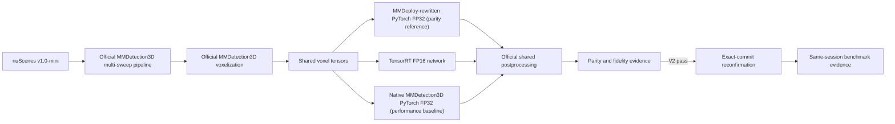

# LaserPerception

> Reproducible real-time 3D LiDAR object detection and deployment engineering.

[](https://github.com/muhammadmahadazher/laserperception/actions/workflows/ci.yml)
[](LICENSE)
[](pyproject.toml)
[](#project-status)

LaserPerception is an open-source 3D LiDAR perception toolkit focused on reproducible real-time
object detection and deployment. The active work is an evidence-gated ROS 2 Humble interface around
the exact verified M2 PointPillars TensorRT FP16 runtime without changing model semantics.

M1 has verified real FP32 inference, framework-independent detections, an original pedestrian BEV
visualization, and a sanitized RTX 4060 Laptop GPU benchmark on nuScenes v1.0-mini. M1 is complete
and merged. M2 exported and checked the pinned ONNX graph and built the official TensorRT FP16
engine. Parity v1 remains an authoritative failure. The separately preregistered parity v2 Stage 1
passed all gates on the same 20 samples and unchanged engine and remains valid. The first M2
benchmark was rejected because it used MMDeploy-rewritten eager PyTorch as the performance
baseline. The repaired exact-commit benchmark uses native MMDetection3D PyTorch FP32 and measures a
direct 1.2991× end-to-end median speedup for TensorRT FP16. PR #3 merged as
`b1d42a0d62646b5d38a9839e69a50fe0d2917a70`.

## Project status

### Review required: M3A — ROS 2 interface rate gate failed

M3A adds a ROS 2 Humble Python package for model-ready multi-sweep PointCloud2 input, the unchanged
M2 TensorRT FP16 runtime, canonical Detection3DArray output, nuScenes replay, and RViz/Foxglove
markers. The exact 20-sample PointCloud2 round-trip fidelity gate passes.

The first 20 Hz diagnostic failed the preregistered callback-median and sustained-rate gates, so no
M3 result is canonical and M3B is not authorized. No postprocessing optimization, raw single-sweep
adapter, tracking, model change, or M4 work has started. See [`docs/ROS2.md`](docs/ROS2.md) and
[`benchmarks/m3/README.md`](benchmarks/m3/README.md).

### Existing experimental infrastructure

The earlier SemanticKITTI-to-DALES semantic-segmentation work remains in the repository as tested,
supported infrastructure, but it is parked rather than the active development line before
detection v0.1. It currently provides:

- a validated float32 `PointCloud` representation;
- KITTI/SemanticKITTI and LAS/optional LAZ I/O;
- official-split SemanticKITTI and chunked DALES directory adapters;
- explicit, non-mutating `min_xyz` normalization;
- verified mappings into a six-class experimental ontology;
- deterministic DALES grid patching and CPU-only dataset audit tooling; and
- synthetic tests that download no datasets.

No semantic-segmentation model, training run, or accuracy benchmark has been implemented. The
historical Experiment 001 config remains at
[`configs/experiments/exp001_semkitti_to_dales.yaml`](configs/experiments/exp001_semkitti_to_dales.yaml).

## Architecture

The lightweight core and standard CI remain CPU-only. M1 and M2 GPU dependencies live in isolated
WSL environments and are imported only by optional detector/deployment backends.



nuScenes is not routed through the existing single-scan `PointCloud`: PointPillars inference keeps
the official calibrated, multi-sweep upstream pipeline. See
[`docs/ARCHITECTURE.md`](docs/ARCHITECTURE.md).

## Core installation

LaserPerception supports Python 3.10–3.13 in CPU CI. The base package has no CUDA, PyTorch, or
MMDetection3D dependency.

```bash
git clone https://github.com/muhammadmahadazher/laserperception.git
cd laserperception
python -m venv .venv
python -m pip install --upgrade pip
python -m pip install -e .
```

Install `laserperception[laz]` for compressed LAZ support, `laserperception[viz]` for the optional
headless renderer, or `laserperception[dev,laz]` for local development. No dataset or model is
downloaded by core installation. The reproducible M1 GPU setup is documented in
[`docs/DETECTION_ENVIRONMENT.md`](docs/DETECTION_ENVIRONMENT.md) and does not make heavy libraries
core requirements. See [`docs/DETECTION.md`](docs/DETECTION.md) for data preparation and commands.

## Existing CPU quickstart

```python
import numpy as np
from laserperception import PointCloud

cloud = PointCloud(
    xyz=np.array([[10.0, 20.0, 2.0], [11.5, 19.0, 3.0]]),
    labels=np.array([0, 1]),
    attributes={"intensity": np.array([120, 240])},
    metadata={"source": "synthetic"},
)
print(len(cloud), cloud.xyz.dtype)  # 2 float32
```

Load existing point-cloud formats and normalize explicitly:

```python
from laserperception.io import load_kitti_bin, load_las
from laserperception.transforms import normalize_coordinates

kitti = load_kitti_bin("sequences/00/velodyne/000000.bin")
las = load_las("tile.las")
normalized = normalize_coordinates(kitti, mode="min_xyz")
```

Dataset paths come from configuration or environment variables; datasets, checkpoints, and
generated artifacts must remain outside Git.

## Benchmarks

The historical M1 measured record is
benchmarks/m1/results/rtx4060_laptop_fp32.json.

The repaired M2 measured record is
benchmarks/m2/results/rtx4060_pytorch_fp32_vs_tensorrt_fp16.json. At exact measurement commit
`3f240d60569b53a2e4445d34b0905a807cf54879`, native PyTorch FP32 measured a 59.289 ms end-to-end
median and TensorRT FP16 measured 45.637 ms, a direct 1.2991× median speedup. The corresponding
network-only medians were 19.189 ms and 6.126 ms, a secondary 3.1326× speedup.

The earlier run at `e2f9b6babb541d52beaa0bcd58e841a0a56cc851` remains rejected and is retained
only as benchmarks/m2/diagnostics/rejected_e2f9b6b.json. Its 124.297× network and 23.101×
end-to-end ratios are not canonical evidence. Parity v2 remains PASS and is not invalidated.

The M1 result remains separate historical context:

| Milestone | Model | Dataset | Hardware | Precision | Latency | FPS | Peak VRAM |
|---|---|---|---|---|---|---|---|
| M1 (scene-start index 0; zero history) | Official MMDetection3D PointPillars | nuScenes v1.0-mini | RTX 4060 Laptop GPU | FP32 | 52.896 ms model / 55.097 ms end to end | 18.905 model / 18.150 end to end | 0.381 GiB allocated / 0.400 GiB reserved |
| M2 native baseline (scene-start index 0; zero history) | Same PointPillars | nuScenes v1.0-mini | RTX 4060 Laptop GPU | FP32 | 19.189 ms network / 59.289 ms end to end | 52.114 network / 16.867 end to end | 0.381 GiB network / 0.385 GiB end-to-end allocated |
| M2 TensorRT (scene-start index 0; zero history) | Same PointPillars | nuScenes v1.0-mini | RTX 4060 Laptop GPU | FP16 | 6.126 ms network / 45.637 ms end to end | 163.250 network / 21.912 end to end | 31,519,476-byte engine / 1,212,340,736-byte engine device memory |

The parked SemanticKITTI-to-DALES mIoU, per-class IoU, VRAM, and wall-clock fields also remain
`Pending measurement`. See [`docs/BENCHMARKS.md`](docs/BENCHMARKS.md) for exact boundaries,
complete statistics, memory definitions, parity disclosures, and acceptance criteria.

M3A has no canonical result. Its scene-start, zero-history synthetic 20 Hz diagnostic retained 19.945 Hz replay but measured
238.255 ms callback median, 303.283 ms same-host loopback median, 3.990 Hz output, and 875 bounded-QoS
input drops. The result is a failed rate-gate record for review, not accepted performance; see
[`benchmarks/m3/README.md`](benchmarks/m3/README.md).

## Roadmap

- **M0:** project direction and governance transition.
- **M1:** pretrained PointPillars, nuScenes v1.0-mini, BEV predictions, RTX 4060 FP32 measurements.
- **M2:** parity v2, native/rewrite fidelity, and the repaired canonical benchmark passed; PR #3
  is merged.
- **M3:** model-ready ROS 2 Humble interface and 20-sample fidelity pass; M3A rate gate failed and
  M3B requires explicit review authorization.
- **M4:** evidence-backed v0.1 release.
- **M5:** Jetson measurements only if physical hardware is available.

See [`docs/ROADMAP.md`](docs/ROADMAP.md). Capabilities are not promised before their evidence gate.

## Repository map

```text
configs/experiments/   Parked semantic-transfer research configurations
ros2/                  Isolated ROS 2 Humble Python package, launch, config, and native tests
scripts/ros2/          M3 round-trip and latency evidence tooling
docs/                  Architecture, environment, benchmarks, roadmap, and research documentation
src/laserperception/   Lightweight core, I/O, datasets, audits, and optional detection surface
tests/                 Synthetic CPU tests, including ROS-independent M3 contracts
.github/               CPU CI, security analysis, and contribution templates
```

## Safety and scientific integrity

LaserPerception v0.1 is for research, benchmarking and demo use. It is NOT safety-certified and
must not be treated as a certified perception system for operation around humans. Predictions can
be missed, misclassified, or poorly localized.

No accuracy, latency, throughput, memory, hardware, or dataset statistic is published unless it was
actually measured with documented provenance. Unknown fields use `Pending measurement`.

## Contributing, citation, and licensing

Read [`CONTRIBUTING.md`](CONTRIBUTING.md) and [`AGENTS.md`](AGENTS.md). Do not commit datasets,
point-cloud archives, checkpoints, generated visualizations, raw benchmark outputs, or secrets.

- Questions: [GitHub Discussions](https://github.com/muhammadmahadazher/laserperception/discussions)
- Bugs and features: [GitHub Issues](https://github.com/muhammadmahadazher/laserperception/issues)
- Security: [`SECURITY.md`](SECURITY.md)

Original LaserPerception code is [Apache-2.0](LICENSE). That license does not relicense nuScenes,
SemanticKITTI, KITTI, DALES, MMDetection3D, external weights, papers, or other third-party assets.
See [`THIRD_PARTY_NOTICES.md`](THIRD_PARTY_NOTICES.md). Citation metadata is in
[`CITATION.cff`](CITATION.cff); until a release or paper exists, cite the repository URL and exact
commit rather than inferring a DOI.
