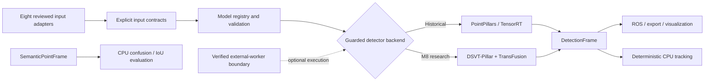

# LaserPerception

> A CPU-first 3D LiDAR perception and deployment-engineering toolkit with explicit data and model
> contracts, deterministic tracking, semantic-result evaluation, reproducible detector evidence,
> ROS 2 integration, and guarded external GPU execution.

[](https://github.com/muhammadmahadazher/laserperception/actions/workflows/ci.yml)
[](CHANGELOG.md)
[](pyproject.toml)
[](LICENSE)


*Historical LaserPerception PointPillars/ROS 2 replay showing real predicted 3D boxes in RViz2.
See the benchmark documentation for the exact frozen runtime and measurement boundaries.*

LaserPerception combines a lightweight, CPU-testable perception platform with optional detector
runtimes. The released historical path wraps the official pretrained MMDetection3D PointPillars
model, deterministic voxelization, TensorRT FP16, ROS 2 Humble, and time-aware raw PointCloud2
multi-sweep reconstruction. The platform now also provides reviewed model manifests, input
adapters, guarded prediction plans, deterministic CPU tracking, immutable semantic results, and
provider-neutral external-worker tooling. The active M8 DSVT-Pillar + TransFusion work now has
an accepted three-process S1 primary A2/E2 raw measurement; scientific interpretation remains
separate and has not been frozen.

[CPU-first quickstart](docs/QUICKSTART_PERCEPTION.md) ·
[Project status](docs/PROJECT_STATUS.md) ·
[v0.4.0 release notes](docs/releases/v0.4.0.md) ·
[Benchmarks and evidence](docs/BENCHMARKS.md)

## What LaserPerception is today

| Capability | Status | Execution | Evidence and documentation |
|---|---|---|---|
| PointPillars detection and TensorRT deployment | Released, historical | Optional GPU environment | [Detection](docs/DETECTION.md), [benchmarks](docs/BENCHMARKS.md) |
| Raw PointCloud2 and time-aware multi-sweep ROS 2 path | Released | ROS 2 plus optional detector runtime | [Raw LiDAR ROS 2](docs/RAW_LIDAR_ROS2.md) |
| Model registry, exact input contracts, validation, dry-run planning | Released | CPU safe | [Perception quickstart](docs/QUICKSTART_PERCEPTION.md) |
| Deterministic class-aware multi-object tracking | Released | CPU | [Tracking](docs/TRACKING.md) |
| Immutable semantic point results and confusion/IoU evaluation | Released infrastructure | CPU | [Semantic results](docs/SEMANTIC_SEGMENTATION.md) |
| Eight reviewed data-adapter paths and local inspection | Released | CPU | [Data adapters](docs/DATA_ADAPTERS.md) |
| Verified external-worker artifacts and fail-closed gates | Released tooling | CPU planning; optional external GPU | [External workers](docs/EXTERNAL_WORKERS.md) |
| DSVT-Pillar + TransFusion detector candidate | Active M8 research | Authorized external GPU only | [M8 status](docs/m8/M8_S1_EXTERNAL_RUNTIME_STATUS.md) |

Semantic infrastructure does not include a production segmentation model. Tracking consumes saved
or precomputed `DetectionFrame` values; no detector-plus-tracker end-to-end benchmark is claimed.

## Latest release and current research

**v0.4.0** packages the perception-platform APIs merged since v0.3.0: guarded model execution,
CPU tracking, semantic-result evaluation, unified data adapters, external-worker tooling, and M8
fail-closed readiness work. The [canonical project-status page](docs/PROJECT_STATUS.md) separates
released capabilities, historical evidence, active research, and future work.

M8 selected the official pretrained DSVT-Pillar + TransFusion candidate. Its frozen S1 primary
A2/E2 campaign later completed three accepted fresh processes and 2,568 canonical calls. The
[raw measurement](docs/m8/M8_S1_MEASUREMENT_RAW.md) is published without scientific interpretation.
The earlier 779-condition `INCOMPLETE` attempt remains preserved with zero accepted canonical
calls. Zero-intensity, S2, and training have not run.

## Quick start — CPU first

```bash
python -m venv .venv
# Linux/macOS: source .venv/bin/activate
# Windows PowerShell: .venv\Scripts\Activate.ps1
python -m pip install -e .

laserperception models list
laserperception data adapters list
python examples/perception_cpu_journey.py .local/cpu-example
python examples/tracking_sequence.py
python examples/semantic_evaluation.py
```

These commands do not require CUDA, PyTorch, ROS, a dataset download, or a model checkpoint.
Optional detector frameworks remain isolated from the core wheel. See
[QUICKSTART_PERCEPTION.md](docs/QUICKSTART_PERCEPTION.md) for deterministic dry-run examples.

## Models and detector status

- `pointpillars-nuscenes-v0.3` identifies the frozen official pretrained PointPillars path used by
  M1–M7. LaserPerception did not train it.
- `dsvt-pillar-transfusion-m8` identifies the active official pretrained DSVT research candidate.
  LaserPerception did not train it. Its accepted S1 primary raw measurement is descriptive and has
  not received a scientific interpretation.
- Model execution is guarded by explicit runtime, artifact, input, and authorization contracts.
  Listing models, validating inputs, and producing dry-run plans are CPU-safe.

## Platform architecture



The core package stays lightweight and CPU-testable. PyTorch, CUDA, OpenMMLab, DSVT/OpenPCDet,
TensorRT, and ROS 2 are optional environments. See [ARCHITECTURE.md](docs/ARCHITECTURE.md).

## Evidence and benchmark snapshot

Canonical internal evidence remains tied to exact commits, artifacts, inputs, hardware, and timing
boundaries. Selected historical facts:

- M2 measured a **1.299134×** direct end-to-end median speedup for TensorRT FP16 over native
  MMDetection3D PyTorch FP32 on the recorded RTX 4060 Laptop GPU session. Its network timing is
  not ROS callback or loopback latency.
- In the representative M3 ROS session, **10 Hz was the highest tested clean sustained** rate;
  15 Hz and 20 Hz were not sustained. These are not portable hardware capability guarantees.
- The M3 hard voxel layer used `exact_fast`, proven bit-exact against the pinned official
  deterministic implementation for the accepted gates.
- M6c closed with a positive projected-reference ROS validation while preserving its earlier R2
  failure. Final ROS integration reproduced 860/860 unique live conditions exactly. M7 preserved
  both corrected results and preflight failures.
- M8 completed three accepted primary A2/E2 processes and 2,568 canonical calls. The
  [raw measurement](docs/m8/M8_S1_MEASUREMENT_RAW.md) is published without a winner or causal claim.

Read [BENCHMARKS.md](docs/BENCHMARKS.md) for canonical, diagnostic, rejected, failed, incomplete,
external, and pending records. Read [FAILURE_INDEX.md](docs/FAILURE_INDEX.md) for preserved negative
results and engineering failures.

## Independent external evaluation

An independent OmniLink/OmniSim evaluation of v0.3.0 reproduced the `MultiSweepBuilder` transform
convention and verified a `233,950 × 4` accumulated native OmniSim input byte-for-byte. In both a
sparse synthetic case and a denser authored scene, the frozen PointPillars detector produced no
valid intended `traffic_cone` match at score threshold 0.25. This is preserved as a negative
synthetic/domain-gap result, not an accuracy or hardware-performance claim. See the
[external evaluation record](docs/external/OMNILINK_OMNISIM_EVALUATION.md).

## M8 Detector V2 status

DSVT-Pillar + TransFusion is the selected M8 candidate. Engineering integration, frozen input
contracts, external-runtime qualification tooling, and fail-closed evidence handling are in place.
See [PROJECT_STATUS.md](docs/PROJECT_STATUS.md) for the current campaign binding and execution
state, and [M8 external-runtime status](docs/m8/M8_S1_EXTERNAL_RUNTIME_STATUS.md) for its supporting
operational ledger.

## Reproducibility

Measurement protocols require commit, configuration, upstream versions, artifact hashes,
dataset/split/sample, sweep history, precision, thresholds, warmups, timing boundaries, environment,
hardware, and memory provenance. Preserved evidence records the available values and uses explicit
nulls with limitation notes when historical fields were not captured. Failed and rejected evidence
remains visible; measurements that have not occurred say `Pending measurement`. See
[REPRODUCIBILITY.md](docs/REPRODUCIBILITY.md) and [CLOUD_WORKFLOW.md](docs/CLOUD_WORKFLOW.md).

## Known limitations

- The released detector evidence covers one official pretrained PointPillars model and bounded
  datasets/hardware; it does not establish universal LiDAR generalization.
- M8 primary A2/E2 raw measurement is complete; scientific interpretation, zero-intensity, S2,
  DSVT training, and DSVT TensorRT parity remain incomplete or unstarted.
- Semantic APIs evaluate saved row-aligned results; no production segmentation model is included.
- CPU tracking is deterministic infrastructure over precomputed detections, without an end-to-end
  detector/tracker benchmark.
- No claim establishes production readiness, autonomous-driving safety, or physical-LiDAR
  validation beyond the explicitly documented historical paths.

## Repository and documentation map

- Start: [perception quickstart](docs/QUICKSTART_PERCEPTION.md),
  [data adapters](docs/DATA_ADAPTERS.md), [tracking](docs/TRACKING.md),
  [semantic results](docs/SEMANTIC_SEGMENTATION.md)
- Design: [architecture](docs/ARCHITECTURE.md), [vision](docs/VISION.md),
  [roadmap](docs/ROADMAP.md), [project status](docs/PROJECT_STATUS.md)
- Evidence: [benchmarks](docs/BENCHMARKS.md), [failure index](docs/FAILURE_INDEX.md),
  [M6 index](docs/m6/README.md), [M7 results](docs/m7/M7_RESULTS.md),
  [M8 status](docs/m8/M8_S1_EXTERNAL_RUNTIME_STATUS.md)
- Operations: [external workers](docs/EXTERNAL_WORKERS.md),
  [cloud workflow](docs/CLOUD_WORKFLOW.md),
  [M8 runbook](docs/m8/M8_EXTERNAL_RUNTIME_RUNBOOK.md)
- Releases: [v0.4.0 notes](docs/releases/v0.4.0.md), [changelog](CHANGELOG.md)

## Licensing and citation

LaserPerception source is Apache-2.0. Datasets, external weights, engines, and third-party software
retain their own terms and are not distributed by the core wheel. See
[THIRD_PARTY_NOTICES.md](THIRD_PARTY_NOTICES.md). Cite v0.4.0 using [CITATION.cff](CITATION.cff) and
record the exact commit for reproducibility. No DOI is claimed.
