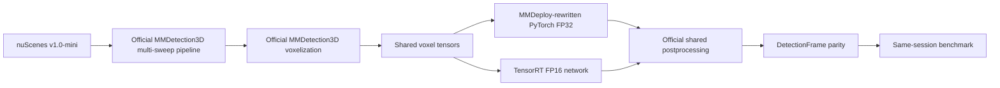

# LaserPerception

> Reproducible real-time 3D LiDAR object detection and deployment engineering.

[](https://github.com/muhammadmahadazher/laserperception/actions/workflows/ci.yml)
[](LICENSE)
[](pyproject.toml)
[](#project-status)

LaserPerception is an open-source 3D LiDAR perception toolkit focused on reproducible real-time
object detection and deployment. The active goal is to deploy the exact verified M1 PointPillars
model through the pinned official MMDeploy ONNX/TensorRT FP16 path without changing model semantics.

M1 has verified real FP32 inference, framework-independent detections, an original pedestrian BEV
visualization, and a sanitized RTX 4060 Laptop GPU benchmark on nuScenes v1.0-mini. M1 is complete
and merged. M2 is active with its deployment boundary and parity criteria frozen before engine
evidence; ONNX, TensorRT, parity, and M2 performance remain `Pending measurement`.

## Project status

### Active: M2 — TensorRT FP16 deployment

M2 is constrained to:

- the exact M1 MMDetection3D 1.4.0 PointPillars config and checkpoint;
- official MMDeploy v1.3.1 at its pinned full commit and TensorRT 8.6.x;
- official shared voxelization and postprocessing outside the TensorRT network;
- a frozen 20-sample parity set and immutable engineering tolerances; and
- same-session PyTorch FP32 versus TensorRT FP16 measurements after parity succeeds.

M2 does not include training, INT8, a second detector, altered anchors/NMS, ROS 2, camera fusion,
custom LaserPerception CUDA plugins, C++, or Jetson work. See
[`docs/TENSORRT.md`](docs/TENSORRT.md) for the frozen boundary and acceptance protocol.

### Existing experimental infrastructure

The earlier SemanticKITTI-to-DALES semantic-segmentation work remains in the repository as tested,
supported infrastructure, but it is parked rather than the active development line before
detection v0.1. It currently provides:

- a validated float32 `PointCloud` representation;
- KITTI/SemanticKITTI and LAS/optional LAZ I/O;
- official-split SemanticKITTI and chunked DALES directory adapters;
- explicit, non-mutating `min_xyz` normalization;
- verified mappings into a six-class experimental ontology;
- deterministic DALES grid patching and CPU-only dataset audit tooling; and
- synthetic tests that download no datasets.

No semantic-segmentation model, training run, or accuracy benchmark has been implemented. The
historical Experiment 001 config remains at
[`configs/experiments/exp001_semkitti_to_dales.yaml`](configs/experiments/exp001_semkitti_to_dales.yaml).

## Architecture

The lightweight core and standard CI remain CPU-only. M1 and M2 GPU dependencies live in isolated
WSL environments and are imported only by optional detector/deployment backends.



nuScenes is not routed through the existing single-scan `PointCloud`: PointPillars inference keeps
the official calibrated, multi-sweep upstream pipeline. See
[`docs/ARCHITECTURE.md`](docs/ARCHITECTURE.md).

## Core installation

LaserPerception supports Python 3.10–3.13 in CPU CI. The base package has no CUDA, PyTorch, or
MMDetection3D dependency.

```bash
git clone https://github.com/muhammadmahadazher/laserperception.git
cd laserperception
python -m venv .venv
python -m pip install --upgrade pip
python -m pip install -e .
```

Install `laserperception[laz]` for compressed LAZ support, `laserperception[viz]` for the optional
headless renderer, or `laserperception[dev,laz]` for local development. No dataset or model is
downloaded by core installation. The reproducible M1 GPU setup is documented in
[`docs/DETECTION_ENVIRONMENT.md`](docs/DETECTION_ENVIRONMENT.md) and does not make heavy libraries
core requirements. See [`docs/DETECTION.md`](docs/DETECTION.md) for data preparation and commands.

## Existing CPU quickstart

```python
import numpy as np
from laserperception import PointCloud

cloud = PointCloud(
    xyz=np.array([[10.0, 20.0, 2.0], [11.5, 19.0, 3.0]]),
    labels=np.array([0, 1]),
    attributes={"intensity": np.array([120, 240])},
    metadata={"source": "synthetic"},
)
print(len(cloud), cloud.xyz.dtype)  # 2 float32
```

Load existing point-cloud formats and normalize explicitly:

```python
from laserperception.io import load_kitti_bin, load_las
from laserperception.transforms import normalize_coordinates

kitti = load_kitti_bin("sequences/00/velodyne/000000.bin")
las = load_las("tile.las")
normalized = normalize_coordinates(kitti, mode="min_xyz")
```

Dataset paths come from configuration or environment variables; datasets, checkpoints, and
generated artifacts must remain outside Git.

## Benchmarks

The measured record is
[`benchmarks/m1/results/rtx4060_laptop_fp32.json`](benchmarks/m1/results/rtx4060_laptop_fp32.json).

| Milestone | Model | Dataset | Hardware | Precision | Latency | FPS | Peak VRAM |
|---|---|---|---|---|---|---|---|
| M1 | Official MMDetection3D PointPillars | nuScenes v1.0-mini | RTX 4060 Laptop GPU | FP32 | 52.896 ms model / 55.097 ms end to end | 18.905 model / 18.150 end to end | 0.381 GiB allocated / 0.400 GiB reserved |

The parked SemanticKITTI-to-DALES mIoU, per-class IoU, VRAM, and wall-clock fields also remain
`Pending measurement`. See [`docs/BENCHMARKS.md`](docs/BENCHMARKS.md) for acceptance criteria.

## Roadmap

- **M0:** project direction and governance transition.
- **M1:** pretrained PointPillars, nuScenes v1.0-mini, BEV predictions, RTX 4060 FP32 measurements.
- **M2:** active—frozen ONNX/TensorRT FP16 parity and same-session benchmark protocol.
- **M3:** ROS 2, only after M2 review.
- **M4:** evidence-backed v0.1 release.
- **M5:** Jetson measurements only if physical hardware is available.

See [`docs/ROADMAP.md`](docs/ROADMAP.md). Capabilities are not promised before their evidence gate.

## Repository map

```text
configs/experiments/   Parked semantic-transfer research configurations
docs/                  Architecture, environment, benchmarks, roadmap, and research documentation
src/laserperception/   Lightweight core, I/O, datasets, audits, and optional detection surface
tests/                 Synthetic CPU tests
.github/               CPU CI, security analysis, and contribution templates
```

## Safety and scientific integrity

LaserPerception v0.1 is for research, benchmarking and demo use. It is NOT safety-certified and
must not be treated as a certified perception system for operation around humans. Predictions can
be missed, misclassified, or poorly localized.

No accuracy, latency, throughput, memory, hardware, or dataset statistic is published unless it was
actually measured with documented provenance. Unknown fields use `Pending measurement`.

## Contributing, citation, and licensing

Read [`CONTRIBUTING.md`](CONTRIBUTING.md) and [`AGENTS.md`](AGENTS.md). Do not commit datasets,
point-cloud archives, checkpoints, generated visualizations, raw benchmark outputs, or secrets.

- Questions: [GitHub Discussions](https://github.com/muhammadmahadazher/laserperception/discussions)
- Bugs and features: [GitHub Issues](https://github.com/muhammadmahadazher/laserperception/issues)
- Security: [`SECURITY.md`](SECURITY.md)

Original LaserPerception code is [Apache-2.0](LICENSE). That license does not relicense nuScenes,
SemanticKITTI, KITTI, DALES, MMDetection3D, external weights, papers, or other third-party assets.
See [`THIRD_PARTY_NOTICES.md`](THIRD_PARTY_NOTICES.md). Citation metadata is in
[`CITATION.cff`](CITATION.cff); until a release or paper exists, cite the repository URL and exact
commit rather than inferring a DOI.
