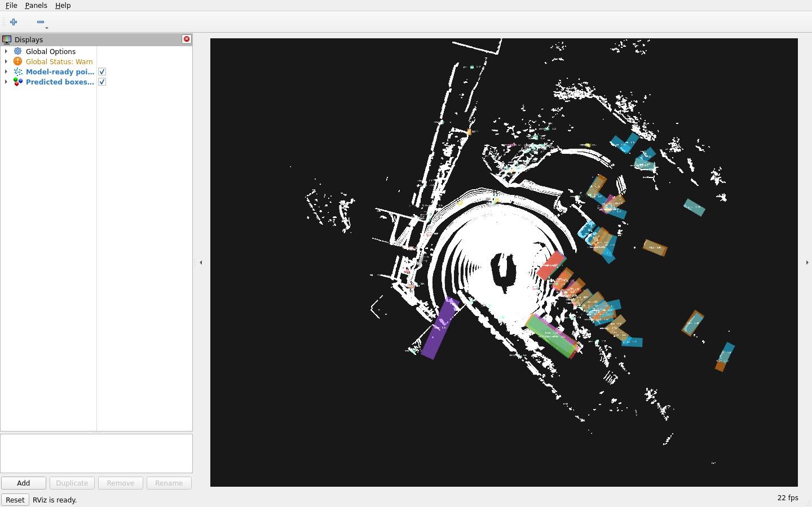
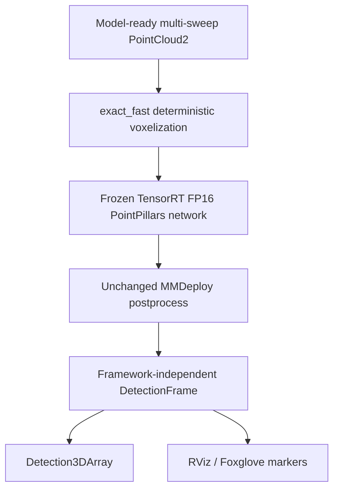

# LaserPerception

> Reproducible 3D LiDAR detection, TensorRT deployment, and ROS 2 integration.

[](https://github.com/muhammadmahadazher/laserperception/actions/workflows/ci.yml)
[](CHANGELOG.md)
[](pyproject.toml)
[](LICENSE)

LaserPerception v0.1.0 is an open-source research toolkit that runs one frozen, official pretrained
PointPillars detector on nuScenes, deploys its network through TensorRT FP16, preserves deterministic
voxel semantics with an exact fast path, and publishes 3D detections through ROS 2 Humble.
LaserPerception did **not** train PointPillars or introduce a new detector architecture.



*Real W1 ROS 2 replay output with predicted 3D boxes in RViz2.*

**Measured release status:** on representative full-history W1 (10 historical sweeps plus current,
354,182 points), 10 Hz was the highest tested clean sustained ROS rate. Fifteen hertz and 20 Hz
were not sustained. This failure is part of the release evidence, not hidden.

[Run the detection/ROS quickstart](docs/QUICKSTART_V0_1.md) ·
[Read the v0.1.0 release notes](docs/releases/v0.1.0.md) ·
[Inspect the benchmark evidence](docs/BENCHMARKS.md)

## What v0.1.0 does—and what was measured

| Engineering story | Shipped behavior | Measured evidence |
|---|---|---|
| TensorRT deployment | Frozen pretrained PointPillars, pinned MMDeploy export, TensorRT 8.6.1 FP16 | Parity-v2 gates passed; repaired scene-start M2 median was 59.289 ms native PyTorch vs 45.637 ms TensorRT end to end (1.2991×) |
| Deterministic voxelization | `exact_fast` preserves pinned official deterministic retained-point semantics | 81/81 validation samples bit-exact; frozen raw/final detector outputs exact; W1 hard layer 238.910 → 1.758 ms (≈136×, hard layer only) |
| ROS 2 integration | Model-ready multi-sweep `PointCloud2` → `Detection3DArray` plus RViz/Foxglove markers | W1 sustained 10 Hz cleanly; 15 Hz and 20 Hz were not sustained |

The accepted M3B-V2 direct W1 live diagnostic changed from about 333 ms to 43.168 ms. The ~43 ms
figure is **direct runtime evidence, not ROS callback or loopback latency**. The ≈136× ratio applies
only to the hard voxel layer, not whole LiDAR inference.

## Reproducibility scope

Correctness claims—exact-fast 81/81 bit-exact voxel outputs, frozen detector exactness, and ROS
message-contract correctness—are semantic/software evidence intended to be reproducible when the
pinned software stack and inputs are reproduced.

Performance claims are measurements from **one system**: an NVIDIA GeForce RTX 4060 Laptop GPU,
WSL2, driver 610.88, and the pinned CUDA/TensorRT/OpenMMLab environment. **Timings are measurements
of this specific environment, not portable hardware capability guarantees.** They do not promise
10 Hz on every RTX 4060 laptop or equivalent behavior on another GPU, Windows native, native Linux,
Jetson, or another environment.

## Current architecture



The ROS input already contains `x`, `y`, `z`, and `time_lag`. v0.1.0 does not build sweep history
from a raw physical-LiDAR topic.

Two explicit policies preserve historical evidence and deployed semantics:

| Use | Voxelization | Provenance |
|---|---|---|
| Historical/core evidence | `official` pinned deterministic hard voxelization | `full` tensor hashes |
| ROS deployment | `exact_fast` LaserPerception implementation | `live` lightweight metadata |

`exact_fast` uses the pinned MMCV dynamic-coordinate CUDA operation plus PyTorch tensor grouping.
It is a LaserPerception deployment optimization, not an upstream MMDetection3D implementation. It
fails closed; there is no silent fallback to `deterministic=False`.

## Quickstart

### Lightweight CPU package

The Python wheel supports Python 3.10–3.13 and does not depend on CUDA, PyTorch, OpenMMLab,
TensorRT, or ROS 2:

```bash
git clone https://github.com/muhammadmahadazher/laserperception.git
cd laserperception
python -m venv .venv
source .venv/bin/activate
python -m pip install --upgrade pip
python -m pip install .
```

```python
import numpy as np
from laserperception import PointCloud, __version__

cloud = PointCloud(xyz=np.array([[0.0, 0.0, 0.0]], dtype=np.float32))
print(__version__, len(cloud), cloud.xyz.dtype)
```

### GPU detector and ROS demo

The validated deployment stack is Ubuntu 22.04 under WSL2, Python 3.10, CUDA 11.8, TensorRT 8.6.1,
and ROS 2 Humble. nuScenes, the official checkpoint, ONNX, and TensorRT engine are external and are
not committed or included in the wheel.

After completing the [v0.1.0 quickstart](docs/QUICKSTART_V0_1.md), launch the real W1 replay and
actual predicted boxes with:

```bash
bash scripts/run_v0_1_demo.sh
```

The wrapper verifies cache roots, frozen hashes, prepared nuScenes mini data, the installed
`exact_fast` / `live` config, pinned versions, and a CUDA operation before delegating to the existing
M3 launch. Missing prerequisites fail with actionable instructions; no licensed dataset is silently
downloaded and no engine is rebuilt.

## Three evidence-backed engineering stories

### 1. TensorRT without changing the detector

M2 froze the pretrained checkpoint, ONNX, engine, samples, thresholds, and deployment boundary.
The parity reference is MMDeploy-rewritten PyTorch FP32; the performance baseline is native
MMDetection3D PyTorch FP32. Rewritten eager PyTorch is deliberately **not** the speedup denominator.

Parity v1 failed and remains preserved. The separately preregistered parity v2 passed all Stage 1
per-metric gates on the unchanged 20-sample suite and engine. The first M2 benchmark was rejected
because it used the wrong denominator; the repaired result is the only canonical M2 performance
record.

### 2. Exact fast voxelization after rejecting the easy shortcut

Official deterministic hard voxelization dominated representative full-history latency. Upstream
`deterministic=False` was fast, but saturated voxels retained different point subsets and frozen
repeatability exposed observable detection changes, so M3B-V1 rejected it.

M3B-V2 then implemented `ExactDeterministicVoxelizer` without custom CUDA/C++. It reproduced all
81 validation voxel tensors bit-for-bit, repeated exactly on W1/W2, and retained exact raw TensorRT
and final detection outputs on the frozen suite. Its direct diagnostics are useful bottleneck
evidence, but they are not ROS timing.

### 3. Honest representative ROS behavior

The final canonical M3 workload is `mini_val` index 42 with 10 historical sweeps plus the current
keyframe. The full run records callback entry through `publish()` return, same-host publisher-stamp
to sink reception, drops, effective output rate, GPU telemetry, and first/second-half backlog
behavior.

- 10 Hz: sustained cleanly, 9.949 Hz useful output, 0/200 measured input drops.
- 15 Hz: not sustained, about 13.34 Hz useful output, 21/221 drops.
- 20 Hz: not sustained, about 10.83 Hz useful output, 159/359 drops; entry intervals and drops grew
  between run halves.

This is behavior consistent with overload in the measured ROS configuration. The evidence does not
establish DDS, executor, or thermal behavior as a single cause.

## Benchmark map

The release separates workloads and evidence types rather than combining incompatible sessions:

- **M1:** historical FP32 warm-cache scene-start index 0, zero historical sweeps.
- **M2:** canonical same-session native PyTorch FP32 vs TensorRT FP16 on that same scene-start input.
- **M3B-V2:** direct diagnostic evidence for exact-fast correctness and component latency.
- **M3:** canonical ROS result on representative full-history W1 index 42.

Start with [BENCHMARKS.md](docs/BENCHMARKS.md), then inspect the sanitized records under
[`benchmarks/`](benchmarks/). The rejected M2 run, failed M3A rate test, rejected M3B-V1 candidate,
and accepted M3B-V2 diagnostics remain visible in the scientific chronology.

## Known issues and limitations

Observed issues include material GPU session-to-session timing variability, an uncontrolled later
M1-style reproduction that differed from the archived M1 result, and decreasing useful output under
15/20 Hz offered-rate overload. Causes were not isolated. See the separate
[Known issues section](docs/releases/v0.1.0.md#known-issues).

v0.1.0 does not include training, tracking, camera fusion, a second detector, INT8, a raw LiDAR
history builder, or Jetson measurements. It is research/demo software, not a safety-certified
perception system.

## Repository map

```text
src/laserperception/   Lightweight CPU core and optional detector/deployment surface
ros2/                  Isolated ROS 2 Humble package, config, launch, and native tests
scripts/                Setup, evidence, validation, and demo entry points
configs/                Frozen detector/deployment protocols and parked experiment config
benchmarks/             Sanitized canonical results and intentionally retained diagnostics
docs/                   Quickstart, architecture, evidence, roadmap, and release notes
tests/                  Synthetic CPU regression suite
```

## Parked experimental infrastructure

The earlier SemanticKITTI-to-DALES `PointCloud`, I/O, transforms, ontology, adapters, and audit
pipeline remain tested and supported, but they are not the v0.1 product line. No segmentation model
or training result exists; those fields remain `Pending measurement`.

## Safety, citation, and licensing

Predictions can be missed, misclassified, or poorly localized. Do not treat LaserPerception as a
certified component for operation around people or vehicles.

Original LaserPerception code is [Apache-2.0](LICENSE). That license does not relicense nuScenes,
external weights, TensorRT engines, ROS/OpenMMLab/NVIDIA components, datasets, or papers. See
[THIRD_PARTY_NOTICES.md](THIRD_PARTY_NOTICES.md). Cite LaserPerception v0.1.0 and, where
reproducibility matters, the exact commit; no DOI is claimed. Citation metadata is in
[CITATION.cff](CITATION.cff).

Questions and contributions: [CONTRIBUTING.md](CONTRIBUTING.md) ·
[GitHub Discussions](https://github.com/muhammadmahadazher/laserperception/discussions) ·
[Security policy](SECURITY.md)