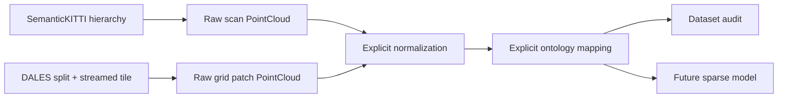
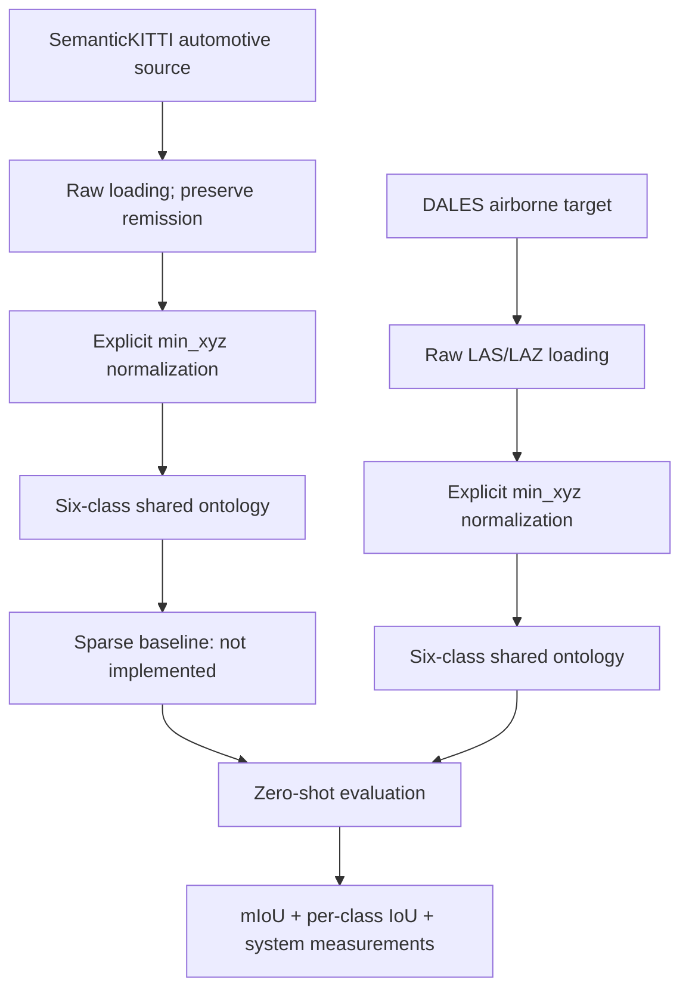

# LaserPerception

> Cross-view 3D LiDAR perception research across automotive and airborne point clouds.

[](https://github.com/muhammadmahadazher/laserperception/actions/workflows/ci.yml)
[](LICENSE)
[](pyproject.toml)
[](#project-status)

LaserPerception is an open-source research framework for studying semantic transfer, domain
generalization, and representation differences across heterogeneous 3D LiDAR acquisition domains.
It begins with geometry-only semantic segmentation transfer from sparse vehicle-mounted automotive
LiDAR in **SemanticKITTI** to dense **DALES** airborne LiDAR.

The repository currently provides a CPU-testable data and dataset-audit layer. It does **not** yet contain a
trained point-cloud deep-learning model, sparse-convolution baseline, or measured benchmark.

## Contents

- [Research question](#research-question)
- [Why this problem matters](#why-this-problem-matters)
- [Project status](#project-status)
- [Architecture](#architecture)
- [Installation](#installation)
- [Quickstart](#quickstart)
- [Experiment 001](#experiment-001)
- [Benchmarks](#benchmarks)
- [Repository map](#repository-map)
- [Roadmap](#roadmap)
- [Reproducibility](#reproducibility)
- [Contributing and support](#contributing-and-support)
- [Citation, license, and acknowledgements](#citation-license-and-acknowledgements)

## Research question

> How well does semantic knowledge learned from sparse vehicle-mounted automotive LiDAR transfer
> zero-shot to dense airborne LiDAR under a shared geometry-only semantic label space?

Experiment 001 studies **SemanticKITTI → DALES** using only `x`, `y`, and `z` as network input
features. File loaders retain available attributes such as remission and LAS dimensions, but the
initial benchmark excludes them from model input for comparability.

## Why this problem matters

Automotive LiDAR and airborne LiDAR observe the same physical world from very different views.
Their point clouds differ in density, occlusion, sampling geometry, coordinate scale, and visible
surfaces. A model trained around a road vehicle may therefore learn representations that do not
transfer to geospatial point clouds captured from above. LaserPerception makes those preprocessing
and ontology decisions explicit so cross-domain LiDAR experiments can be audited and reproduced.

This research is relevant to 3D semantic segmentation, cross-view domain generalization,
autonomous-driving perception, aerial perception, geospatial analysis, and future sparse point-cloud
deep learning. It is not a claim of production readiness or universal sensor generalization.

## Project status

### Works today

- A validated, canonical `PointCloud` representation with float32 geometry
- KITTI/SemanticKITTI float32 `[x, y, z, remission]` scan loading and writing
- Official SemanticKITTI packed semantic/instance label decoding
- LAS loading and optional LAZ loading through `laspy`
- Explicit, non-mutating `min_xyz` coordinate normalization
- Verified SemanticKITTI and DALES mappings into a six-class shared ontology
- Synthetic CPU unit tests that require no dataset download
- Official-split SemanticKITTI directory discovery and scan/label pairing
- Chunked DALES tile reading with deterministic, non-overlapping grid patches
- CPU-only SemanticKITTI and DALES audits with redacted JSON output
- A data-audit-ready configuration for Experiment 001

### Not implemented yet

- Real-dataset audit results or a selected reduced-compute training subset
- Voxelization, sparse-convolution models, training, inference, or evaluation runners
- Source-domain training or zero-shot DALES evaluation
- Measured accuracy, mIoU, per-class IoU, VRAM, or wall-clock results
- 2D LiDAR, object detection, tracking, ROS2, TensorRT, or edge deployment

See [VISION.md](docs/VISION.md) for explicitly aspirational ideas.

## Architecture

LAS is an interchange and storage format here, not a required neural runtime representation. Every
loader produces the same in-memory object, and normalization happens only through an explicit call.





More detail: [Architecture](docs/ARCHITECTURE.md) · [Datasets](docs/DATASETS.md) ·
[Reproducibility](docs/REPRODUCIBILITY.md)

## Installation

LaserPerception supports Python 3.10–3.13 in CI. The core package has no CUDA or GPU framework
dependency.

```bash
git clone https://github.com/muhammadmahadazher/laserperception.git
cd laserperception
python -m venv .venv
python -m pip install --upgrade pip
python -m pip install -e .
```

Install `laserperception[laz]` for compressed LAZ support, or
`laserperception[dev,laz]` for all development tools. No dataset is downloaded by installation.

## Quickstart

### Create a point cloud

```python
import numpy as np
from laserperception import PointCloud

cloud = PointCloud(
    xyz=np.array([[10.0, 20.0, 2.0], [11.5, 19.0, 3.0]]),
    labels=np.array([0, 1]),
    attributes={"intensity": np.array([120, 240])},
    metadata={"source": "synthetic"},
)
print(len(cloud), cloud.xyz.dtype)  # 2 float32
```

Inputs are defensively copied. Point-level attributes stay separate from canonical geometry.

### Load KITTI/SemanticKITTI data

```python
from laserperception.io import load_kitti_bin

cloud = load_kitti_bin(
    "sequences/00/velodyne/000000.bin",
    label_path="sequences/00/labels/000000.label",
)
remission = cloud.attributes["remission"]
semantic_ids = cloud.labels
instance_ids = cloud.attributes["instance_id"]
```

### Load LAS or LAZ

```python
from laserperception.io import load_las

cloud = load_las("tile.las")
classification = cloud.labels
available_dimensions = cloud.metadata["available_dimensions"]
```

Scaled file coordinates are loaded as-is. LAZ requires `laserperception[laz]`.

### Inspect dataset directories

```python
from laserperception.datasets import DalesDataset, SemanticKITTIDataset

semkitti = SemanticKITTIDataset("/data/semantic-kitti", split="train", sequences=["00"])
sample = semkitti.sample_info(0)
raw_scan = semkitti.load(0)

dales = DalesDataset("/data/dales", split="test")
partition = dales.partition_tile(0, patch_size_m=(50.0, 50.0))
raw_patch = partition.patches[0].cloud
```

DALES partitioning uses one chunked pass per tile, retains only XYZ and classification, assigns
half-open non-overlapping grid cells, and skips empty cells while reporting their count. Neither
adapter normalizes coordinates or maps labels automatically.

### Audit a safe subset

```bash
python -m laserperception.audit semantickitti --split train --sequences 00 --max-samples 5
python -m laserperception.audit dales --split test --max-tiles 1 \
  --patch-size-x 50 --patch-size-y 50 --normalization min_xyz \
  --json audit-reports/dales-test.json
```

Roots come from `--root` or the dataset environment variables. JSON reports contain sequence/frame
or tile IDs rather than absolute source paths.

### Normalize coordinates explicitly

```python
from laserperception.transforms import normalize_coordinates

normalized = normalize_coordinates(cloud, mode="min_xyz")
print(normalized.xyz.min(axis=0))
print(normalized.metadata["coordinate_normalization"])
```

The original cloud is unchanged. Dataset locations should be configured outside Git through
`LASERPERCEPTION_SEMANTICKITTI_ROOT` and `LASERPERCEPTION_DALES_ROOT`, as documented in the
[Experiment 001 config](configs/experiments/exp001_semkitti_to_dales.yaml).

## Experiment 001

| Field | Policy |
|---|---|
| Source | SemanticKITTI automotive LiDAR |
| Target | DALES airborne LiDAR |
| Task | Zero-shot semantic segmentation transfer |
| Input features | `x`, `y`, `z` only |
| Normalization | Explicit `min_xyz`: per scan for source, per patch for target |
| DALES patching | Configurable 50 m × 50 m deterministic grid reference; no overlap |
| Reference voxel size | 0.30 m |
| Shared classes | Ground, Building, Natural, Vehicle, Pole, Fence |
| Model | Not implemented |
| Status | Data audit ready; model not implemented |

The ontology uses contiguous IDs `0..5` in the order shown and `-1` for ignored or unmapped labels.
Source IDs are cited from authoritative material; grouping them is an explicit LaserPerception
experiment policy.

## Benchmarks

No benchmark has been run. Every result remains explicit until measured.

| Experiment | Source → Target | Input | Normalization | Voxel size | mIoU | Per-class IoU | Peak VRAM | Wall-clock |
|---|---|---|---|---:|---|---|---|---|
| exp001 | SemanticKITTI → DALES | xyz | min_xyz | 0.30 m | Pending measurement | Pending measurement | Pending measurement | Pending measurement |

See [docs/BENCHMARKS.md](docs/BENCHMARKS.md) for the durable result schema.

## Repository map

```text
configs/experiments/   Research configurations
docs/                  Architecture, data, roadmap, and research documentation
src/laserperception/   Core, I/O, dataset adapters, audit, transforms, and ontology
tests/                 Synthetic CPU tests
.github/               CI, security analysis, and contribution templates
```

## Roadmap

```mermaid
flowchart LR
    subgraph NOW["NOW — V0.1"]
      A["PointCloud"] --> B["Raw I/O"] --> C["Dataset adapters"]
      C --> D["Grid patching"] --> E["Dataset audit"] --> F["Exp001 data pipeline"]
    end
    subgraph NEXT["NEXT — after real-data audit"]
      G["Select sparse backend"] --> H["Sparse-voxel baseline"] --> I["Source training"]
      I --> J["Zero-shot evaluation"] --> K["Evidence-driven ablation"]
    end
    subgraph FUTURE["FUTURE — conditional"]
      L["See docs/VISION.md"]
    end
    F --> G
    K --> L
```



Milestones are evidence-gated; see [ROADMAP.md](docs/ROADMAP.md).

## Reproducibility

Benchmark reports must include the exact commit SHA, config snapshot, dataset version and terms,
preprocessing and ontology versions, random seeds, environment, hardware, metric implementation,
wall-clock method, and peak GPU-memory method. Unknown values remain `Pending measurement`.

## Contributing and support

Read [CONTRIBUTING.md](CONTRIBUTING.md) and the agent rules in [AGENTS.md](AGENTS.md). Do not commit
datasets, checkpoints, secrets, or generated experiment outputs.

- Questions: [GitHub Discussions](https://github.com/muhammadmahadazher/laserperception/discussions)
- Bugs and features: [GitHub Issues](https://github.com/muhammadmahadazher/laserperception/issues)
- Security: [SECURITY.md](SECURITY.md)
- Common questions: [FAQ](docs/FAQ.md)

## Citation, license, and acknowledgements

Citation metadata is in [CITATION.cff](CITATION.cff). Until a release or paper exists, cite the
repository URL and exact commit; do not infer a DOI.

Original source code is [Apache-2.0](LICENSE). That license does not relicense datasets, papers,
external weights, or third-party software. See [DATASETS.md](docs/DATASETS.md) and
[THIRD_PARTY_NOTICES.md](THIRD_PARTY_NOTICES.md).

LaserPerception is informed by official [SemanticKITTI](https://semantic-kitti.org/) and
[DALES](https://openaccess.thecvf.com/content_CVPRW_2020/html/w11/Varney_DALES_A_Large-Scale_Aerial_LiDAR_Data_Set_for_Semantic_Segmentation_CVPRW_2020_paper.html)
resources and research including [CVGC](https://arxiv.org/abs/2602.14525). These works are not
bundled with or relicensed by LaserPerception.
