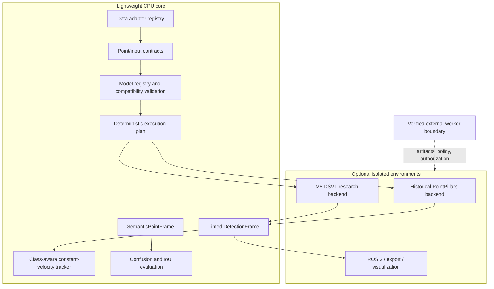

# Architecture

LaserPerception separates a lightweight CPU platform from optional detector, deployment, ROS, and
external-worker environments. The core wheel can inspect metadata, validate contracts, plan work,
track saved detections, and evaluate saved semantic results without discovering GPU hardware.

## Present-day system

### Data ingestion

The data registry exposes eight manifests without importing readers. Adapters describe features,
labels, temporal support, calibration, coordinates, optional dependencies, and limitations.
Inspection dispatches to canonical existing readers; it does not normalize or silently infer model
compatibility. See [DATA_ADAPTERS.md](DATA_ADAPTERS.md).

### Perception contracts and guarded execution

Model manifests bind tasks, input features, coordinates, temporal semantics, runtime targets, and
artifact requirements. Planning validates the input description and execution context without
loading an optional backend. Execution requires explicit runtime resources and, where applicable,
runtime-scoped authorization.

`DetectionFrame` keeps boxes framework-independent: center XYZ, length-width-height, yaw, class,
score, and optional velocity with an explicit coordinate frame. Export and visualization filtering
remain separate from inference.

### CPU tracking

P2 consumes explicitly timestamped, precomputed `DetectionFrame` values. Association is
deterministic and class-aware by default; state uses a constant XY velocity model and explicit
birth, confirmation, miss, and deletion rules. It neither imports detector frameworks nor claims
an end-to-end detector/tracker benchmark.

### Semantic results and evaluation

P3 represents immutable point-wise class results with strictly increasing source-row indices,
taxonomy and coordinate descriptions, source identity, and optional confidence. CPU evaluation
builds confusion matrices and IoU summaries. It is infrastructure for externally produced
predictions, not a bundled segmentation model.

### External workers

Worker tooling verifies artifacts, plans tasks, binds paths, records qualifications, and persists
evidence while remaining provider-neutral. GPU discovery and inference occur only inside an
explicitly selected external runtime. Runtime policies and authorizations are machine-specific and
fail closed. See [EXTERNAL_WORKERS.md](EXTERNAL_WORKERS.md) and
[CLOUD_WORKFLOW.md](CLOUD_WORKFLOW.md).

## Detector backends

### Historical released PointPillars path

M1–M7 use the official pretrained MMDetection3D PointPillars checkpoint and pinned nuScenes
preprocessing. The deployment path exports only the network to TensorRT FP16; official preparation,
voxelization, shared postprocessing, and LaserPerception conversion remain outside the engine.

The production ROS path uses the NumPy-only multi-sweep builder and `exact_fast` deterministic
voxelizer. Compatible raw PointCloud2 input passes through bounded history and time-aware
`lookup_transform_full`. The accepted ROS column-vector-to-builder mapping is
`rotation = R.T`, `translation = -R.T @ t`.

### Active M8 DSVT research path

M8 uses a lazy, optional DSVT/OpenPCDet backend for the selected DSVT-Pillar + TransFusion
candidate. The feature contract is `[x, y, z, intensity, time_lag]`; source-row and condition order
are frozen. The S1 runtime enforces exact artifacts, input receipt, qualification, policy, and
authorization. No accepted primary A2/E2 result exists. See
[M8 status](m8/M8_S1_EXTERNAL_RUNTIME_STATUS.md).

## Dependency boundaries

The core wheel declares NumPy and laspy only, with small optional extras. PyTorch, CUDA,
MMDetection3D, MMDeploy, ONNX, TensorRT, DSVT/OpenPCDet, spconv, torch-scatter, and ROS 2 are not
core dependencies. Heavy environments and artifacts remain external and hash-verified.

## Evidence boundaries

Canonical, diagnostic, failed, rejected, incomplete, and external evidence have distinct labels.
Frozen historical records are never rewritten to match current status. Current navigation starts
at [PROJECT_STATUS.md](PROJECT_STATUS.md), [BENCHMARKS.md](BENCHMARKS.md), and
[FAILURE_INDEX.md](FAILURE_INDEX.md).
