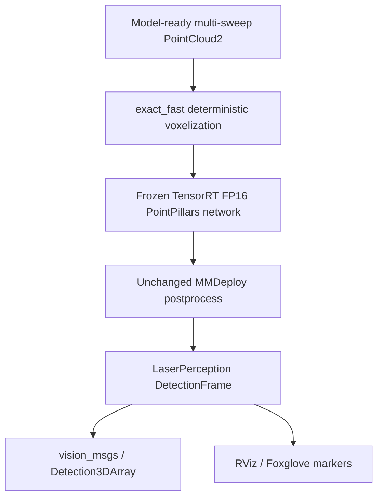
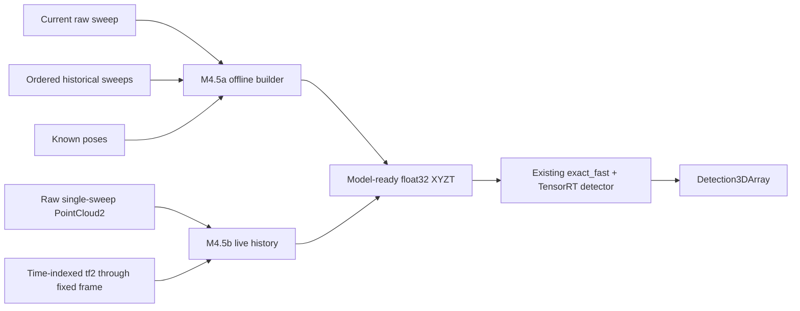
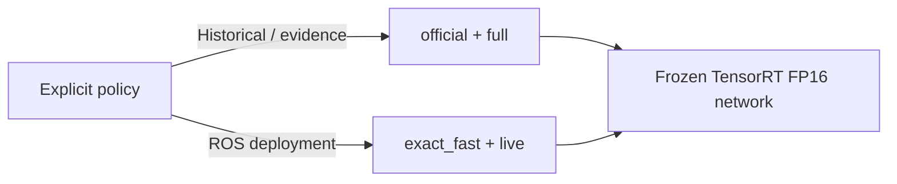

# Architecture

LaserPerception v0.1.0 keeps a lightweight CPU package separate from an optional, pinned GPU/ROS
deployment stack. The deployed detector is an official pretrained MMDetection3D PointPillars model;
LaserPerception did not train or reimplement it.

## v0.1 model-ready deployment path

The input contract requires `x`, `y`, `z`, and `time_lag` and preserves the source header. The
v0.1 ROS path remains model-ready: it does not reconstruct history, perform TF lookup, or accept a
raw single-sweep physical-LiDAR topic.

## Post-v0.1 M4.5 raw ingestion

M4.5 adds two reviewed boundaries before the unchanged model-ready detector:

M4.5a is the NumPy-only reconstruction core. M4.5b decodes compatible float32 XYZ PointCloud2,
keeps up to ten earlier acquisitions, obtains source-time-to-current-time transforms with
`tf2_ros.Buffer.lookup_transform_full`, and delegates exact accumulation semantics to the same
`MultiSweepBuilder`. The current acquisition frame is the target when `target_frame` is empty.
A dedicated `TransformListener(..., spin_thread=True)` services TF while the node uses a bounded
lookup timeout, so waiting in the point callback does not starve TF reception.

The live path exactly matched the accepted M4.5a model-ready input and the complete frozen detector
chain on 20/20 samples. It accepts compatible streams only; it does not provide calibration,
localization, odometry, per-point deskew, or a vendor driver. Contracts and evidence are in
[`docs/MULTISWEEP.md`](MULTISWEEP.md) and [`docs/RAW_LIDAR_ROS2.md`](RAW_LIDAR_ROS2.md).

The TensorRT network still produces `cls_score`, `bbox_pred`, and `dir_cls_pred`. The existing
MMDeploy postprocess remains unchanged. LaserPerception converts final predictions into a
framework-independent `DetectionFrame`, then the ROS package converts that contract to
`Detection3DArray` and visualization markers.

## Voxelization and provenance policy

- `official` is the historical/core evidence default and uses pinned deterministic MMCV hard
  voxelization.
- `exact_fast` is the ROS deployment choice. `ExactDeterministicVoxelizer` is a LaserPerception
  implementation that uses pinned MMCV dynamic coordinates plus PyTorch grouping and was proven
  bit-exact against official outputs on all 81 validation samples.
- `full` provenance includes exact tensor hashes and remains the evidence default.
- `live` provenance records lightweight semantic metadata and is selected explicitly by ROS.
- Initialization fails closed. The upstream `deterministic=False` shortcut remains rejected and is
  never a fallback.

No custom CUDA/C++ kernel, voxel geometry change, model change, ONNX re-export, engine rebuild, or
postprocess replacement was introduced by the accepted exact-fast path.

## Detector and evidence boundaries

M1 preserves the official calibrated nuScenes multi-sweep pipeline and exposes a small
LaserPerception-owned result contract. nuScenes is not routed through the parked single-scan
`PointCloud` abstraction.

M2 separates two roles:

- parity reference: MMDeploy-rewritten PyTorch FP32 versus TensorRT FP16;
- performance baseline: native MMDetection3D PyTorch FP32 versus TensorRT FP16.

The rewritten eager graph is needed to validate export semantics but is not the runtime speedup
denominator. Historical scene-start benchmark inputs and representative full-history ROS inputs are
reported separately.

## Dependency boundary

The wheel packages `src/laserperception` only. Core types, I/O, datasets, transforms, ontology,
audit, detection contracts, geometry, and offline multi-sweep reconstruction remain CPU-testable.
PyTorch, CUDA, MMDetection3D, MMDeploy, ONNX, TensorRT, and ROS 2 remain isolated optional
dependencies and are imported only by optional paths.

Standard GitHub CI does not install GPU or ROS dependencies. Manual integration gates validate the
pinned WSL2 environment, external artifact hashes, CUDA device execution, clean colcon build,
ROS-native tests, and production-path smoke.

## Detection result boundary

Public detections document coordinate frame, XYZ axes, length-width-height order, geometric center,
yaw, source class, score, and optional velocity. Raw upstream class names are preserved. Display or
export filtering occurs after model execution and does not redefine the measured detector path.

## Parked segmentation architecture

This earlier infrastructure remains tested and supported. Readers preserve point-level data and do
not silently normalize, crop, voxelize, or augment. Its semantic-segmentation model, training, and
accuracy results remain `Pending measurement` and outside the v0.1 detector line.
