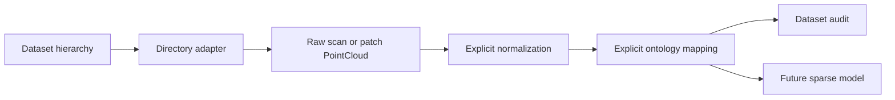

# Architecture

LaserPerception V0.1 keeps file decoding, geometry transforms, ontology mapping, future modeling,
and evaluation as distinct stages.



## File format to `PointCloud`

Readers preserve point-level information and never silently translate, center, scale, crop,
voxelize, or augment coordinates. KITTI remission and SemanticKITTI instance IDs remain attributes.
LAS/LAZ classification becomes labels while other stored dimensions remain attributes.

LAS is an interchange/storage format, not a required runtime neural representation.

## Directory adapters and patching

`SemanticKITTIDataset` resolves the official sequence hierarchy and keeps the official split
manifest separate from optional experiment subsets. `sample_info()` exposes stable sequence/frame
provenance; `load()` delegates scan decoding to the existing KITTI I/O layer.

`DalesDataset` deliberately does not call the full `load_las()` interchange reader. It streams a
tile with `laspy.open(...).chunk_iterator(...)`, uses float64 scaled coordinates for grid assignment,
and retains only XYZ plus classification. A single pass partitions one tile into raw non-empty
patches. Optional LAS dimensions are neither materialized as attributes nor propagated into patches.

Grid cells are non-overlapping half-open XY intervals anchored at the tile header minimum. Empty
cells are skipped and counted. A partition conserves all finite points; non-finite points are
reported separately.

## Explicit preprocessing order

```text
LOAD -> CROP/PATCH -> NORMALIZE -> ONTOLOGY MAP -> future voxelization
```

Adapters stop after load or crop. The audit may request normalization and mapping, but records those
as distinct report stages. This makes raw, patch-only, normalized, and ontology-mapped evidence
separately inspectable.

## Canonical representation

`PointCloud` owns validated copies of float32 `xyz` with shape `(N, 3)`, optional one-dimensional
labels, named point attributes, and descriptive metadata. It intentionally has no model hierarchy
or hidden preprocessing policy.

## Explicit transforms

Transforms return new clouds and record their parameters. V0.1 implements only `min_xyz`, defined
as `xyz - xyz.min(axis=0)`. Additional modes require a documented experiment and tests.

## Ontology and future model

Named, cited mappings convert source IDs into six shared classes; unmapped labels receive ignore ID
`-1`. A mapping change is a preprocessing-version change. Future models must consume explicit
features, voxelization, ontology, and config policies. Evaluation must retain per-class counts and
the complete reproducibility record.

## Dependency direction

`core` depends on NumPy. `io` adds `laspy`. `datasets` composes core I/O and streamed laspy access;
`audit` composes datasets, transforms, and ontology. No layer depends on an ML framework. Model
code must not leak into readers, adapters, or audit utilities.
