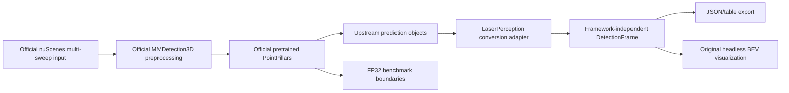
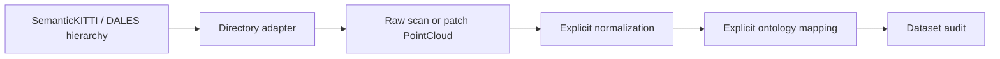

# Architecture

LaserPerception keeps its lightweight CPU core separate from optional detector backends and their
heavy CUDA environments.

M1 uses the upstream MMDetection3D nuScenes pipeline, model implementation, voxelization, and NMS.
LaserPerception does not reproduce those algorithms. Its owned surface is intentionally small: an
asset manifest, lazy backend wrapper, documented result contract, visualization geometry, and
benchmark/reporting helpers.

## Dependency boundary

`laserperception.core`, I/O, datasets, transforms, ontology, and audit remain importable and tested
with the base CPU dependencies. Detection data types and geometry helpers must also remain CPU-only.
The MMDetection3D adapter imports PyTorch and OpenMMLab lazily and raises an actionable error when
the isolated detection environment is unavailable. Standard CI does not install GPU dependencies.

## Detection result boundary

MMDetection3D predictions are converted into a LaserPerception-owned `DetectionFrame`; public
results do not contain upstream classes or tensors. The contract documents coordinate frame, XYZ
axes, one fixed dimension order, yaw convention, class identity, scores, and optional velocity.
Raw upstream class names are preserved. Export/visualization score filtering occurs after model
execution and therefore does not redefine the benchmarked model path.

## nuScenes is not a `PointCloud` adapter

Official nuScenes PointPillars inference uses calibrated sensor metadata and a multi-sweep pipeline.
M1 preserves that upstream representation and does not route it through the existing single-scan
`PointCloud` or its normalization transforms. Dataset roots, prepared metadata, checkpoints, caches,
and artifacts stay outside the repository.

## Parked segmentation architecture

Readers preserve point-level information and never silently translate, center, scale, crop,
voxelize, or augment coordinates. LAS remains interchange/storage rather than a neural runtime
representation. `min_xyz` remains explicit and non-mutating. This pipeline is tested and supported,
but its future semantic-segmentation model is inactive before detection v0.1.
