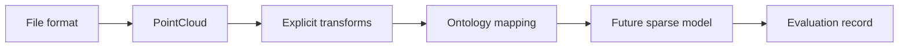

# Architecture

LaserPerception V0.1 keeps file decoding, geometry transforms, ontology mapping, future modeling,
and evaluation as distinct stages.

## File format to `PointCloud`

Readers preserve point-level information and never silently translate, center, scale, crop,
voxelize, or augment coordinates. KITTI remission and SemanticKITTI instance IDs remain attributes.
LAS/LAZ classification becomes labels while other stored dimensions remain attributes.

LAS is an interchange/storage format, not a required runtime neural representation.

## Canonical representation

`PointCloud` owns validated copies of float32 `xyz` with shape `(N, 3)`, optional one-dimensional
labels, named point attributes, and descriptive metadata. It intentionally has no model hierarchy
or hidden preprocessing policy.

## Explicit transforms

Transforms return new clouds and record their parameters. V0.1 implements only `min_xyz`, defined
as `xyz - xyz.min(axis=0)`. Additional modes require a documented experiment and tests.

## Ontology and future model

Named, cited mappings convert source IDs into six shared classes; unmapped labels receive ignore ID
`-1`. A mapping change is a preprocessing-version change. Future models must consume explicit
features, voxelization, ontology, and config policies. Evaluation must retain per-class counts and
the complete reproducibility record.

## Dependency direction

`core` depends on NumPy. `io` adds `laspy`. `transforms` and `ontology` do not depend on datasets or
ML frameworks. Model code must not leak into file readers.
