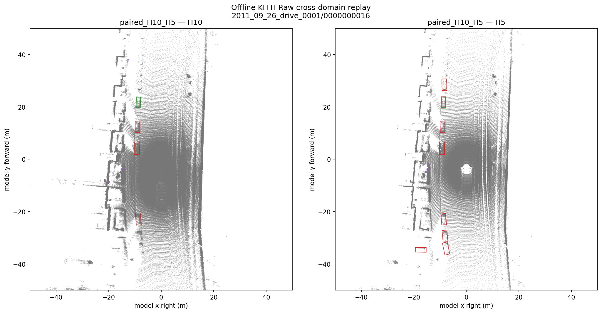
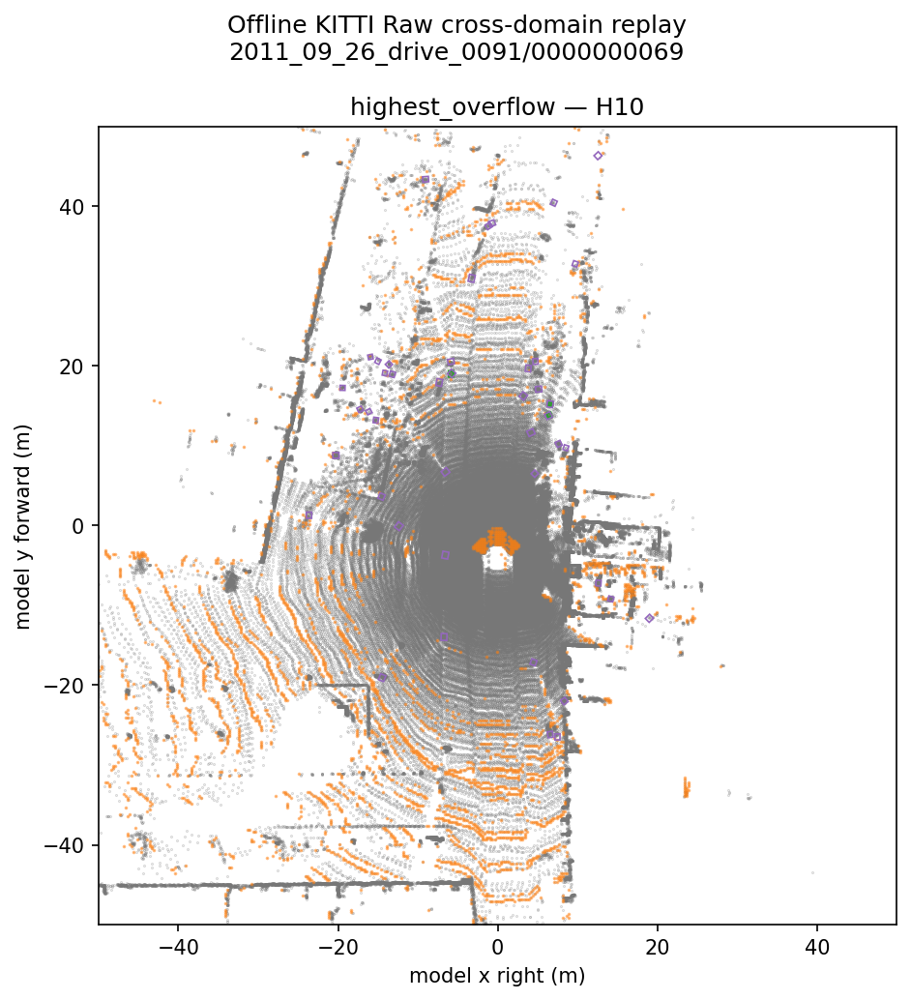
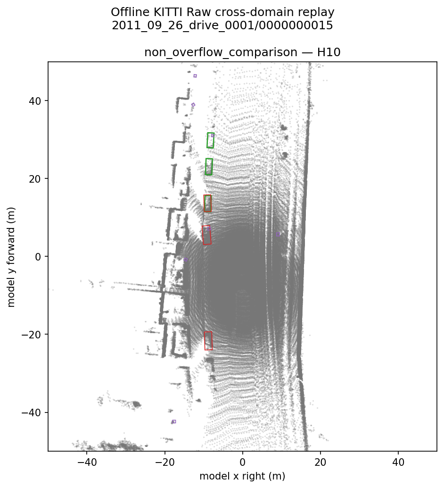
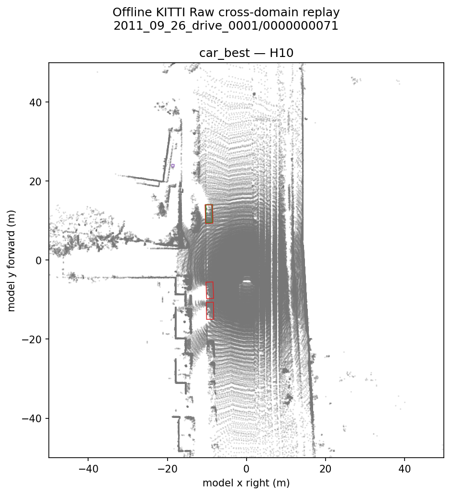

# Moving a Frozen nuScenes PointPillars Deployment to KITTI Raw

## Cross-domain failures, deployment constraints, and history sensitivity without fine-tuning

## Abstract

LaserPerception ran an unchanged, nuScenes-trained PointPillars deployment on selected official
KITTI Raw drives without fine-tuning. Under the preregistered offline protocol, Car recall changed
from 0.242 with ten historical sweeps (H10) to 0.727 with five (H5), while Pedestrian recall changed
from 0.553 to 0.677. H10 versus H5 was a compound history ablation, so the result establishes
strong sensitivity to accumulated-history configuration but does not isolate temporal span,
`time_lag`, point density, pillar population, or another individual cause. The 40,000-voxel cap was
not supported as the primary explanation for the corpus-wide H10 deficit.

## Scope and claim boundary

This is an offline, preregistered cross-domain characterization on two selected official KITTI Raw
drives. It is not official KITTI AP, a leaderboard submission, a KITTI-trained detector result, a
safety claim, evidence about every sensor or scene, or proof that H5 is universally preferable. It
does not evaluate ROS, live sensing, latency, or real-time operation. The model, checkpoint, ONNX,
precision, postprocessing, score threshold, class mapping, and voxel geometry remained frozen.

The first practical problem was not a score: the source and target data products expose the frozen
deployment to materially different sampling and accumulation regimes.

| Input property | nuScenes source regime | KITTI Raw M6 regime |
|---|---:|---:|
| LiDAR beams/channels | 32 | 64 |
| Acquisition rate | 20 Hz | 10 Hz |
| Representative current acquisition | 34,752 points (nuScenes W1) | 98,322–123,259 points (accepted M6a acquisitions) |
| H10 temporal span | Approximately 0.5 s | Median 1.035418 s |
| Representative accumulated input | 354,182 points (nuScenes W1) | H10 mean 1,330,654; median 1,334,420 |
| Candidate pillar population | Lower source-regime population | H10 median 30,699; range 19,023–43,810 |

The sensor specifications come from the official [nuScenes overview](https://www.nuscenes.org/nuscenes?frame=0&sceneId=scene-0100&view=lidar),
[nuScenes detection task](https://www.nuscenes.org/object-detection?externalData=all&mapData=all&modalities=Lidar),
[KITTI Raw page](https://www.cvlibs.net/datasets/kitti/raw_data.php), and
[KITTI sensor paper](https://www.cvlibs.net/publications/Geiger2013IJRR.pdf). The point, span, and
pillar values are measured LaserPerception evidence. These differences motivated the experiment;
they do not prove which difference caused a detection change.

## Why M6 existed

LaserPerception's accepted deployment was built around an official pretrained PointPillars model,
nuScenes preprocessing, deterministic voxelization, and a TensorRT FP16 network. A successful
in-domain deployment does not establish that its input contract, transforms, TensorRT profile, or
detections will transfer to a different LiDAR and annotation product. M6 therefore separated two
questions:

1. Can official KITTI Raw acquisitions be reconstructed into the model-ready frame exactly enough
   to trust the adapter?
2. Once the adapter is verified, what does the unchanged detector do on a frozen cross-domain
   corpus?

That separation mattered because both stages produced useful failures before the final
characterization.

## M6a: a failed pose product before a passing oracle

The first Tier-A pose-oracle attempt failed. It compared KITTI Raw synced OXTS poses with KITTI
Odometry poses as though they were interchangeable samples of one trajectory. They are distinct
official data products with different timing and serialization routes. The failure was preserved;
the acceptance rule was not weakened after observing it.

R1 diagnosed that data-product/timing mismatch. Prospective Protocol R2 then implemented the exact
KITTI Raw-devkit OXTS and calibration arithmetic and compared like with like. The diagnostic drive
`2011_09_30_drive_0016`—the Raw sequence corresponding to Odometry sequence 04—passed 271/271
available-frame comparisons. The canonical reconstruction drive `2011_09_26_drive_0001` passed
108/108. The first drive validated the pose adapter; the second was the M6 reconstruction/evaluation
drive. One drive did not silently stand in for both roles. See the
[M6a R2 result](M6A_RESULTS_R2.md) and preserved
[pose-oracle diagnosis](M6A_POSE_ORACLE_DIAGNOSIS.md).

This exactness oracle was ROS-independent and did not initialize the detector. It froze source-row
order, timestamp arithmetic, transforms, range semantics, and model-frame conversion before any
cross-domain predictions were accepted.

## A fixed model frame, not an implicit convention

KITTI Velodyne coordinates use +X forward, +Y left, and +Z up. The frozen detector expects +X
right, +Y forward, and +Z up. LaserPerception applies one fixed proper rotation before detection:

```text
    [ 0 -1  0 ]
A = [ 1  0  0 ]    det(A) = +1
    [ 0  0  1 ]
```

Tracklet ground truth is converted independently but consistently: bottom/contact centers become
geometric centers, KITTI `(h, w, l)` becomes detector `(l, w, h)`, and yaw is normalized after
`yaw_model = yaw_kitti + pi/2`. This mapping was frozen before evaluation; it was not selected to
improve detections. The full convention is recorded in
[MODEL_FRAME_ALIGNMENT.md](MODEL_FRAME_ALIGNMENT.md).

## M6b's first failure: the engine could not represent a valid input

The historical M2 TensorRT profile accepted at most 30,000 voxels, while the pinned deterministic
preprocessing contract may retain 40,000. The original M6b corpus generation reproduced all 856
H10/H5 model-ready inputs exactly, then stopped before network execution when a valid input exceeded
the historical engine profile. It produced zero evaluation network outputs and zero predictions.

The mismatch was structural, not a KITTI accuracy result. In the frozen corpus, 218/428 H10 frames
exceeded 30,000 candidate pillars and 68/428 reached the 40,000 retention cap. Under H5, 174/428
exceeded 30,000, although none reached 40,000. Treating the stopped run as detector evidence would
have conflated engine feasibility with model behavior.

The prospective remediation rebuilt only the TensorRT optimization profile from the byte-identical
ONNX. The old MIN/OPT/MAX values of 4,352/18,207/30,000 became 4,352/18,207/40,000. The OPT value
was historical, not tuned on KITTI. The candidate retained the frozen model and passed:

- the 20-sample nuScenes parity-v2 suite;
- same-session old-versus-new checks where both profiles were valid;
- a non-evaluation high-shape KITTI H10 case and the previously uncovered H5 profile band; and
- deterministic repeatability at the 40,000 maximum and at a shared mid-range profile point.

The wider profile required 1,602,800,640 bytes of TensorRT device memory versus 1,212,340,736 bytes
for the historical engine. No latency or optimization claim was attached to the rebuild. Only after
the structural gates passed was [M6b Protocol R2](M6B_PROTOCOL_R2.md) frozen and the first evaluation
prediction allowed.

## The final frozen characterization

The corpus used frames 10–107 of `2011_09_26_drive_0001` (98 frames) and frames 10–339 of
`2011_09_26_drive_0091` (330 frames). Each of the 428 current frames was reconstructed twice:

- **H10:** current acquisition plus ten historical sweeps;
- **H5:** current acquisition plus five historical sweeps.

All 856 conditions completed with the same detector and candidate engine. The primary operating
point was score at least 0.25 and oriented BEV IoU at least 0.50. Evaluation covered only Car and
Pedestrian against eligible KITTI Raw tracklets inside the reference-camera field of view.

KITTI Raw tracklets are incomplete for the full LiDAR world. Therefore precision and AP below are
**annotation-conditioned against the available Raw tracklets**, not a physical false-positive rate
and not official KITTI benchmark AP.

| Class | H10 recall | H5 recall |
|---|---:|---:|
| Car | 0.242 | 0.727 |
| Pedestrian | 0.553 | 0.677 |

| Condition | Class | TP | FP | FN | Annotation-conditioned precision | Recall | F1 | Raw-tracklet AP |
|---|---|---:|---:|---:|---:|---:|---:|---:|
| H10 | Car | 16 | 144 | 50 | 0.100 | 0.242 | 0.142 | 0.0601 |
| H5 | Car | 48 | 261 | 18 | 0.155 | 0.727 | 0.256 | 0.2424 |
| H10 | Pedestrian | 219 | 3,831 | 177 | 0.054 | 0.553 | 0.099 | 0.0865 |
| H5 | Pedestrian | 268 | 3,868 | 128 | 0.065 | 0.677 | 0.118 | 0.1269 |



*Offline KITTI Raw evaluation output for the frozen paired H10/H5 example. This is not ROS, live
LiDAR, or real-time evidence.*

## What H10 versus H5 does—and does not establish

| Input statistic | H10 | H5 |
|---|---:|---:|
| Mean points | 1,330,654 | 726,561 |
| Median points | 1,334,420 | 728,279 |
| Median temporal span | 1.035418 s | 0.517701 s |
| Distinct `time_lag` values | 11 | 6 |
| Median candidate pillars | 30,699 | 24,792 |
| Candidate-pillar range | 19,023–43,810 | 14,957–35,157 |
| Frames at the 40,000 cap | 68/428 | 0/428 |

**H10 versus H5 is a compound temporal-and-density history ablation. The improvement under H5
establishes strong sensitivity to the accumulated-history configuration, but this experiment does
not isolate temporal span, `time_lag`, point density, pillar population, or another individual
factor.**

`time_lag` is an explicit detector input. H10 exposed the frozen model to a median 1.035418-second
history, while H5 reduced that span to 0.517701 seconds, close to the approximately half-second
source regime. A temporal-feature mismatch is consequently a plausible hypothesis for a future
controlled experiment. It is not the established cause here: shortening history simultaneously
changed accumulated point density, occupied pillars, occlusion/aggregation patterns, and the
distribution of time values.

## Negative result: the 40,000 cap was not the primary H10 explanation

H10 overflow occurred on 68/428 frames; H5 had no overflow. If the cap were the dominant
corpus-wide reason for H10's lower recall, overflow status should have aligned directionally with
the deficit. It did not:

| Class | H10 recall on overflow frames | H10 recall on non-overflow frames |
|---|---:|---:|
| Car | 0.231 | 0.245 |
| Pedestrian | 0.638 | 0.535 |

The mixed association does not support the 40,000 cap as the primary corpus-wide explanation. It
also does **not** prove that truncation has no effect on an individual target, frame, or other
dataset.



*Offline KITTI Raw H10 evaluation output for the highest-overflow selected frame. Orange points
mark discarded-pillar support; this is not ROS or live-sensor output.*



*Offline KITTI Raw H10 output for the frozen closest non-overflow comparison. Visual pairing is
descriptive and does not turn overflow into a causal treatment.*

### What deterministic retention discarded

Every H10 discarded pillar was first touched by one of the three oldest sweeps: sweep 8 contributed
5,165 (4.14%), sweep 9 contributed 48,096 (38.57%), and sweep 10 contributed 71,435 (57.29%). No
pillar first touched by the current acquisition or history sweeps 1–7 was discarded. This identifies
a measured preprocessing mechanism—the deterministic first-occurrence ordering protected more
recent first touches in this corpus—but does not establish detector-quality causality.

The preregistered spatial test was also deliberately two-part. The Pearson 2x12 homogeneity
statistic was 19,354.05, above the 24.72497 critical value at alpha 0.01, so strict sector
homogeneity was rejected. However, the highest-drop sector agreed with each frame's highest sector
on only 19.12% of overflow frames, below the frozen greater-than-50% practical-directionality gate.
The combined conclusion was therefore **“spatially non-uniform truncation” not established**. The
large statistic remains descriptive evidence, not permission to omit the failed practical gate.

## Geometric and range transfer

H5 Car true-positive counts were 48, 48, and 44 at oriented BEV IoU thresholds 0.30, 0.50, and
0.70. That stability through 0.50 and modest reduction at 0.70 suggests that many matched H5 Car
boxes retained useful BEV geometry. It is a narrow observation about matched detections, not a
general localization or calibration guarantee.

| Condition | Class | 0–20 m TP/GT (recall) | 20–35 m TP/GT (recall) | 35–50 m TP/GT (recall) |
|---|---|---|---|---|
| H10 | Car | 12/27 (0.444) | 4/30 (0.133) | 0/6 (0.000) |
| H5 | Car | 27/27 (1.000) | 17/30 (0.567) | 4/6 (0.667) |
| H10 | Pedestrian | 168/288 (0.583) | 51/106 (0.481) | 0/2 (0.000) |
| H5 | Pedestrian | 191/288 (0.663) | 75/106 (0.708) | 2/2 (1.000) |

The far-range denominators—six Car and two Pedestrian poses—are too small for broad conclusions.
Three of the 66 eligible Car poses also lie outside the frozen 0–50 m bins, so the table's Car range
denominator is 63 while the overall class denominator remains 66.



*The best Car example selected by the frozen metric rule from offline KITTI Raw evaluation output;
it was not manually substituted for visual quality and is not ROS/live evidence.*

## Why the failures matter

The M6a pose-oracle failure and the first M6b engine-profile failure both happened before final
measurement, and both remain in the record. Each repair was prospective:

- M6a R2 changed the pose-comparison contract after R1 identified a distinct official data product;
  it did not retroactively pass the original Tier-A check.
- M6b R2 widened only the structural TensorRT profile after the original run stopped before the
  network; it did not use evaluation predictions to choose the engine or operating point.

This chronology prevents a common cross-domain error: quietly repairing a deployment incompatibility
after observing final scores and then presenting the result as if the pipeline had been frozen all
along. Here, the original failures, diagnoses, prospective protocols, and final evidence are
separately identifiable.

## Reproducibility

The public Markdown result documents are the starting point:

- [M6a R2 reconstruction result](M6A_RESULTS_R2.md)
- [M6b Protocol R2](M6B_PROTOCOL_R2.md)
- [M6b final result](M6B_RESULTS.md)

The exact implementation/evidence identities are:

- M6b squash commit on `main`: `903a1593ec65a1547c1d0ccd5449de9eb2e4f87c`
- inference measurement and final preregistration commit:
  `9159682fadfc069eeb70e07acb76dd0a929db98f`
- corpus: drives `2011_09_26_drive_0001` and `2011_09_26_drive_0091`, 428 current frames and
  856 H10/H5 conditions
- checkpoint SHA256:
  `f19d00a38e6b775f38a45a9a3ca3ecaec20a5585a3caf44622423e2d5f75d5d0`
- ONNX SHA256: `61ce22a8ca31498675c32576bfb94f0093d31dc95d2762f7254bf915a59ecc16`
- 40,000-profile engine SHA256:
  `2e790b1cdbdc1b88c2aafdc81b5921ebee152edd8408158f88437ae4dd1f3e7f`
- tracked compact result:
  [`benchmarks/m6b/results/kitti_raw_cross_domain_characterization.json`](../../benchmarks/m6b/results/kitti_raw_cross_domain_characterization.json),
  SHA256 `b9d47120aabb38733d79f987f16277ebab626d2b7c13159c40c30a68b76c1d26`
- tracked compact input ledger:
  [`benchmarks/m6b/diagnostics/pre_inference_input_ledger.json`](../../benchmarks/m6b/diagnostics/pre_inference_input_ledger.json),
  SHA256 `2413224808b0140856a0e00f884c53bc9b49ec6b545172f5e7fa57d00802dc15`

The immutable full result is intentionally outside Git: logical name
`kitti_raw_cross_domain_characterization_full.json`, 41,987,113 bytes, SHA256
`87870b2aa0cc2a91d39331afc8154fdad0c8c796f1cabfb4f8530a3eb106de27`. The immutable full input
ledger is also external: logical name `pre_inference_input_ledger_full.json`, 5,837,452 bytes,
SHA256 `e25b3d62113cc7e8c1fcf736caa68b1ab698f965f007c758ff91d3e498ca6caa`. These files are hash-pinned
generated evidence and are not redistributed by this repository. They may be suitable for future
release assets, but this note does not publish them or create a release.

## Engineering lessons

1. **Verify data-product identity before tuning numeric tolerances.** “Official KITTI pose” was not
   a sufficient contract; Raw OXTS and Odometry products differed in timing and arithmetic route.
2. **Treat deployment profiles as part of the input contract.** A correct 40,000-voxel tensor was
   unusable with a 30,000-profile engine even though the model and ONNX were valid.
3. **Freeze cross-domain geometry before viewing predictions.** Explicit axes, centers, dimensions,
   and yaw conversion kept adapter correctness separate from detection quality.
4. **Do not convert a compound ablation into a single-factor story.** H5 changed temporal span,
   `time_lag`, density, and pillar population together.
5. **Keep negative and stopped results.** The failed pose oracle, zero-prediction engine stop, weak
   overflow association, and failed spatial-directionality gate constrain the claims as much as the
   recall increase does.
6. **A sweep count is not a fixed physical time window.** Sensor rate changed H10's temporal span,
   while deterministic first-touch ordering affected which pillar support survived the hard cap.

## Future controlled experiments—not performed here

Two prospective studies could isolate the leading hypotheses. One could hold H10 geometry and
point/pillar population fixed while changing only the encoded `time_lag` values. Another could
preserve H10 temporal timestamps while subsampling or otherwise controlling density to match H5's
point and pillar population. Either experiment would need its own preregistered protocol and frozen
corpus. M6 did not run either study and does not choose a production history setting.

## The M6c boundary

M6c, if separately authorized, is an integration-correctness task:

```text
KITTI Raw
  -> raw PointCloud2
  -> time-aware TF
  -> live multi-sweep builder
  -> byte-exact comparison with the offline oracle
  -> 40,000-profile engine
  -> Detection3DArray
```

It is not another model study and has not started. M6b establishes the offline frozen-detector
characterization; it does not pre-claim ROS reconstruction exactness, live behavior, or performance.
